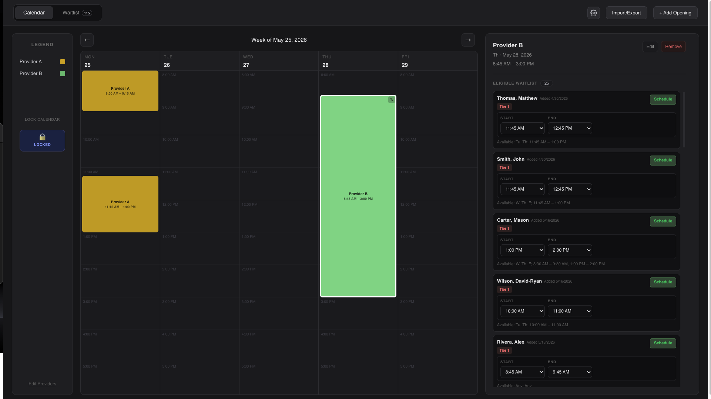
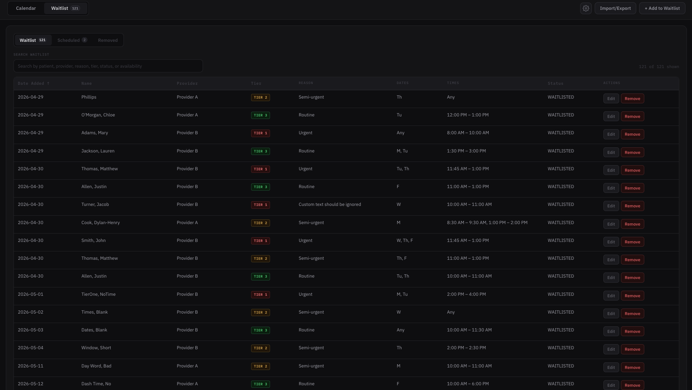

# Appointment Manager

Appointment Manager is a desktop application for filling new appointment openings with eligible patients from a waitlist.

The app is designed for local use in a medical office workflow. It stores appointment openings, providers, waitlist patients, scheduled records, and removed records on the user's computer.

## Calendar

Providers are displayed on the left, and their openings are displayed on the calendar in the center. Clicking an opening shows eligible waitlist patients who can fill that appointment time.

### Features

- Add new openings
- Edit, move, resize, or remove current openings
- Warn when adding or scheduling into a past opening
- Enforce minimum appointment durations
- Mark openings as surgery openings when longer appointment timing is required
- Add, edit, or remove providers
- Automatically purge openings 14 days after they have passed

## Waitlist

The waitlist displays all current patients waiting for an appointment. Separate views are available for scheduled patients and removed patients for tracking purposes.

### Features

- Search active, scheduled, and removed patients
- Sort active waitlist patients by date added, name, provider, tier, or status
- Add, edit, or remove patients from the waitlist
- Prevent duplicate or overlapping availability time ranges
- Truncate long reasons in table and card views while allowing the full reason to be viewed when selected
- View scheduled patients
- View removed patients
- Delete scheduled or removed records when needed
- Track patient status across waitlisted, scheduled, and removed sections
- Automatically purge old scheduled records and removed records after 14 days

## Import Requirements

Excel imports support flexible column order when a header row is included. If no valid header row is found, the app expects columns in this order:

`Date Added`, `Name`, `Provider`, `Tier`, `Reason`, `Available Days`, `Available Times`

| Column          | Required | Accepted Header Names                              | Accepted Input Examples                                                                                                            | Notes                                                                                                                                                                                                                                    |
| --------------- | -------: | -------------------------------------------------- | ---------------------------------------------------------------------------------------------------------------------------------- | ---------------------------------------------------------------------------------------------------------------------------------------------------------------------------------------------------------------------------------------- |
| Date Added      |      Yes | `Date Added`, `Date`                               | `5/24/2026`, `05/24/26`, `5-24-2026`, `5/24`, Excel date cell                                                                      | If no year is given, the current year is used. Excel date cells and Excel serial date numbers are supported. Text like `2026-05-24` is not currently supported.                                                                          |
| Name            |      Yes | `Name`, `Patient`, `Patient Name`                  | `Smith, John`, `John Smith`, `Smith`                                                                                               | `Smith, John` parses as last name `Smith`, first name `John`. `John Smith` parses as first name `John`, last name `Smith`. A single word becomes last name only.                                                                         |
| Provider        |      Yes | `Provider`, `Doctor`                               | `Dr. Smith`, `Smith`, `Jones`                                                                                                      | Any non-empty text works. If the provider does not already exist, the import adds it.                                                                                                                                                    |
| Tier            |      Yes | `Tier`, `Priority`, `Priority Tier`                | `1`, `2`, `3`, `Tier 1`, `Priority 2`, `3 - Routine`                                                                               | The parser looks for the first `1`, `2`, or `3` anywhere in the cell. `Urgent` by itself does not work unless it also contains `1`.                                                                                                      |
| Reason          |       No | `Reason`, `Notes`                                  | `Urgent`, `Semi-urgent`, `Routine`, `Consult`, `Follow-up`                                                                         | If blank, the reason defaults from the tier: Tier 1 → `Urgent`, Tier 2 → `Semi-urgent`, Tier 3 → `Routine`.                                                                                                                              |
| Available Days  |       No | `Dates`, `Available Days`, `Days`                  | `M`, `Mon`, `Monday`, `Tu`, `Tue`, `Tuesday`, `W`, `Wed`, `Wednesday`, `Th`, `Thu`, `Thursday`, `F`, `Fri`, `Friday`, `Any`, blank | Multiple values can be separated by spaces, commas, semicolons, or slashes. Blank or `Any` means any day. Weekends are not supported.                                                                                                    |
| Available Times |       No | `Times`, `Available Times`, `Availability`, `Time` | `8am-12pm`, `8:00am-12:00pm`, `8-12pm`, `1pm-3pm`, `8am to 12pm`, `8am-12pm, 1pm-3pm`, `Any`, blank                                | Multiple time ranges can be separated by commas or semicolons. Blank or `Any` means any time. Times must be within 8:00 AM–6:00 PM, each range must contain at least one full hour, and duplicate or overlapping ranges are not allowed. |

## Local Data and Backups

Appointment Manager stores data locally on the computer where the app is installed. The app does not upload patient, provider, appointment, waitlist, backup, or import/export data to a server.

The local database and full app backups are encrypted before being written to disk. Excel imports and exports are separate files created only when the user chooses to import or export waitlist data.

Backups are intended for restoring data on the same computer. If the app needs to be moved to another computer, the data should be migrated separately.

Automatic backups are created before major data changes such as saves, imports, resets, and restores. Automatic backups are kept for up to one year, with a maximum retained backup count.

Backups are separate from Excel imports and exports. Excel files are used for waitlist data transfer, while backups are used to preserve and restore the full local application state.

## Tech Stack

- React
- TypeScript
- Electron
- SQLite
- ExcelJS
- CSS

## Screenshots

## Future Improvements

- Send automated text messages when scheduling a patient
- Improve scheduling notifications and reminders
- Add a selected backup restore screen so users can choose a specific backup by date
- Add a formal computer migration workflow for encrypted backups
- Extract utilities and helpers from App.tsx

## License

All rights reserved.

This code may not be used, copied, modified, distributed, or reused without prior written permission from Vince Matolka.
